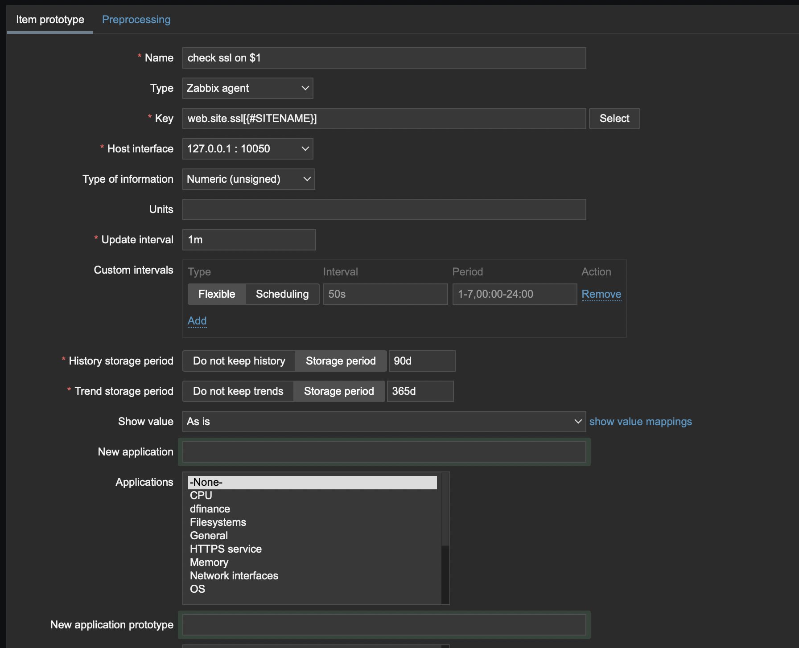

# zabbix-mass-check
How use zabbix for mass checking of web sites

## Task

I need to check many web-sites for availability and ssl certificate expires. And that must be done by zabbix. I found little outdated manual on https://blog.51cto.com/215687833/1886671 

## Script

1. web_site_discovery - get JSON list of web sites
```bash
./site_check.sh web_site_discovery
{
	"data":[
		{ 
			"{#SITENAME}":"site1"},
			....
			{ 
			"{#SITENAME}":"site2"}]}

```
2. web_site_code - request HTTP responce code
```bash
$ ./site_check.sh web_site_code google.com
301
```
3. web_site_ssl - get number of days befor ssl certificate expire
```bash
$ ./site_check.sh web_site_ssl google.com
53
```

## Zabbix-agent config

```
UserParameter=web.site.discovery,/etc/zabbix/site_check.sh web_site_discovery
UserParameter=web.site.code[*],/etc/zabbix/site_check.sh web_site_code $1
UserParameter=web.site.ssl[*],/etc/zabbix/site_check.sh web_site_ssl $1
```

You can check config by manual request

```bash
zabbix_get -p 10050 -s localhost -k web.site.discovery
zabbix_get -p 10050 -s localhost  -k web.site.code[google.com]
```

## Zabbix config

1. Configuration - Hosts - Host with zabbix-agent and script
2. Discovery rules
3. Create Discovery rule

Use `web.site.discovery` for key


4. Create item prototype

Use `web.site.code[{#SITENAME}]` or `web.site.ssl[{#SITENAME}]` as a key



5. Create trigger prototype

use `{Zabbix server:web.site.ssl[{#SITENAME}].last()}<5` for expression or what you want


## Done


